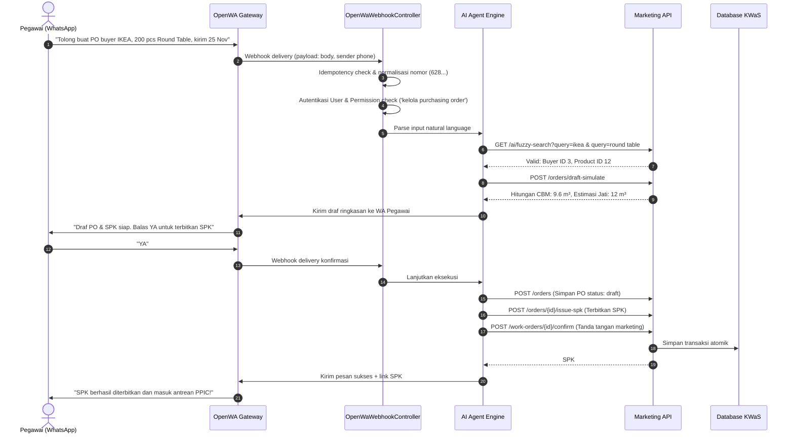
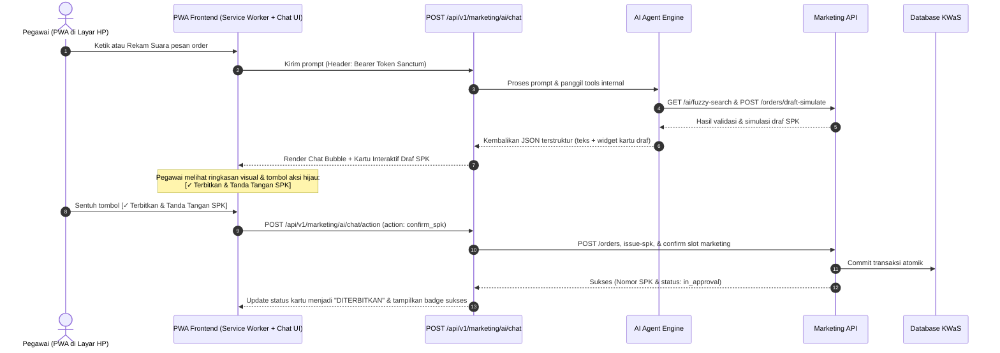

# Spesifikasi Teknis & Panduan Implementasi API Marketing (Dual-Channel AI: WhatsApp & PWA Chatbot)

Dokumen ini berisi spesifikasi arsitektur, standar teknis, katalog endpoint, skema data, serta panduan implementasi **AI Agent** dengan pendekatan **Dual-Channel (Opsi 1: WhatsApp via OpenWA & Opsi 2: PWA Chatbot Mandiri)** untuk pembuatan **RESTful API Marketing** pada sistem KWaS.

---

## 1. Ruang Lingkup & Latar Belakang

### 1.1 Realitas Operasional: Kebiasaan Pegawai Melapor via Chat
Di lantai pabrik dan operasional harian industri manufaktur kayu KWaS, staf marketing dan perwakilan lapangan terbiasa mencatat dan melaporkan order buyer secara cepat melalui media percakapan teks (*chat-first workflow*). Mengisi formulir web ERP konvensional yang kaku sering dirasa lambat dan merepotkan (*high friction*).

### 1.2 Strategi Dual-Channel AI Agent
Untuk menjamin keandalan sistem tanpa mengorbankan kemudahan pegawai, platform KWaS menerapkan arsitektur **Dual-Channel**:

```
                              ┌────────────────────────────────────────┐
                              │           Pegawai / Marketing          │
                              └──────────────────┬─────────────────────┘
                                                 │
                        ┌────────────────────────┴────────────────────────┐
                        ▼                                                 ▼
        ┌───────────────────────────────┐                 ┌───────────────────────────────┐
        │     OPSI 1 (Jalur Utama)      │                 │      OPSI 2 (Jalur Cadangan)  │
        │   WhatsApp Chat via OpenWA    │                 │     PWA Chatbot Khusus KWaS   │
        │  • Tanpa instalasi tambahan   │                 │  • Bebas risiko session WA putus│
        │  • Sangat familiar bagi staf  │                 │  • Kartu interaktif & tombol    │
        │  • Cepat dari lapangan        │                 │  • Bisa di-install di HP        │
        └───────────────┬───────────────┘                 └───────────────┬───────────────┘
                        │                                                 │
                        │ Webhook (OpenWA)                                │ REST / SSE Streaming
                        ▼                                                 ▼
        ┌─────────────────────────────────────────────────────────────────────────────────┐
        │                   AI Marketing Agent Engine (LLM Reasoner)                      │
        │          • Parsing Natural Language (Intent & Entity Extraction)                │
        │          • Tool Calling / Function Calling ke API Backend                       │
        │          • Penghitungan CBM, Pencocokan BOM, & Penyusunan Draf SPK              │
        └────────────────────────────────────────┬────────────────────────────────────────┘
                                                 │
                                                 ▼
        ┌─────────────────────────────────────────────────────────────────────────────────┐
        │                      RESTful API Marketing (Sistem KWaS)                         │
        │         • Master Catalogs  • Buyers CRUD  • PO Headers & Details                │
        │         • Draft Simulation • SPK Issuance • Marketing Digital Approval          │
        └────────────────────────────────────────┬────────────────────────────────────────┘
                                                 │
                                                 ▼
        ┌─────────────────────────────────────────────────────────────────────────────────┐
        │                         Database KWaS (PostgreSQL / MySQL)                       │
        │         purchasing_orders, purchasing_order_details, work_orders, dll.          │
        └─────────────────────────────────────────────────────────────────────────────────┘
```

1. **Opsi 1 — WhatsApp Gateway via OpenWA (Jalur Utama / Primary Channel)**:
   - Memfasilitasi kebiasaan alami pegawai yang sudah terbiasa berkomunikasi via WhatsApp.
   - Pegawai cukup mengirim chat teks, rekapan PO, atau foto order ke nomor bot WhatsApp KWaS.
2. **Opsi 2 — PWA Chatbot Mandiri (Jalur Cadangan & Dedicated In-House Channel)**:
   - Solusi mitigasi (*failover*) jika gateway WhatsApp mengalami kendala (misal: session OpenWA terputus, butuh scan QR ulang, delay server WA, atau nomor dibatasi provider).
   - Progressive Web App (PWA) ringan yang dapat di-install langsung di layar utama smartphone (*Add to Home Screen*) pegawai tanpa melalui Google Play / App Store.
   - Menyediakan pengalaman antarmuka chat mirip WhatsApp, namun dengan keunggulan komponen visual yang lebih kaya (*Rich Interactive UI*): kartu preview draf SPK, tombol konfirmasi 1-klik (*Quick Reply Buttons*), tabel ringkasan CBM/BOM, dan audio recording input.
3. **Satu Otak, Dua Jalur (Single Agent Brain)**:
   - Baik pesan yang masuk dari WhatsApp maupun dari PWA Chatbot akan diproses oleh **AI Agent Engine yang sama** (`AiMarketingAgentService`) dan mengeksekusi **API Marketing yang sama**. Tidak ada duplikasi aturan bisnis.

---

## 2. Arsitektur Detail: Opsi 1 (WhatsApp) vs Opsi 2 (PWA Chatbot)

### 2.1 Perbandingan Karakteristik Kanal

| Karakteristik | Opsi 1: WhatsApp (OpenWA) | Opsi 2: PWA Chatbot KWaS |
|---|---|---|
| **Instalasi** | Tidak perlu (aplikasi WhatsApp sudah ada di HP) | 1-klik via browser (*Add to Home Screen*) |
| **Ketergantungan Layanan** | Bergantung pada OpenWA Gateway & server WA | 100% Mandiri pada server KWaS |
| **Bentuk Antarmuka** | Pesan teks WA, formatting bold/italic/bullet | Chat bubble modern + Kartu interaktif + Tombol aksi |
| **Autentikasi User** | Pencocokan nomor telepon pengirim ke database (`phone_number`) | Login Akun KWaS / Token Sanctum tersimpan aman |
| **Konfirmasi SPK** | Balasan teks tegas (contoh: *"YA"*, *"SETUJU"*) | Tombol sentuh 1-klik *"Terbitkan & Tanda Tangan SPK"* |
| **Koneksi Jaringan** | Butuh koneksi internet stabil | Mendukung *offline caching* data dasar & push alert |
| **Penanganan Media** | Kirim teks dan unduh dokumen/gambar via WA | Upload foto spesifikasi & audio recorder langsung di web |

---

### 2.2 Alur Eksekusi Opsi 1: WhatsApp via OpenWA



---

### 2.3 Alur Eksekusi Opsi 2: PWA Chatbot KWaS (Fallback & Rich UI)



---

## 3. Standar Kepatuhan Kode (`AGENTS.md`)

Setiap kode baru yang dibangun untuk API maupun AI Agent wajib mematuhi panduan ketat berikut:

- **Filosofi Lazy Developer**: Kode sederhana, linear, tanpa over-engineering, langsung menyelesaikan masalah.
- **Pemisahan Tanggung Jawab (Separation of Concerns)**:
  - `routes/api.php`: Menampung rute RESTful dan endpoint AI.
  - `app/Http/Controllers/Api/Marketing/...`: Orkestrator controller (HTTP layer).
  - `app/Http/Requests/Api/Marketing/...`: Validasi form request di boundary.
  - `app/Http/Resources/Api/Marketing/...`: Serialisasi JSON response.
  - `app/Services/AiMarketingAgentService.php`: Layanan pemrosesan bahasa alami, fuzzy lookup, dan pemanggilan tool internal.
- **Aturan Penamaan (Naming Convention)**:
  - camelCase maksimal **dua kata** deskriptif dalam Bahasa Inggris tanpa singkatan (misal: `buyerId`, `orderNumber`, `targetDate`, `cubicMeter`, `confirmedAt`, `userPrompt`, `actionType`).
- **Pencegahan Anti-Pattern N+1 Query**:
  - Dilarang keras query di dalam perulangan (*loop*).
  - Selalu gunakan *Eager Loading* (`with(['buyer', 'details.product.materials'])`).
- **Standar Format Logging**:
  - Format baku menggunakan kurung biasa: `(YYYY-MM-DD HH:mm:ss) functionality message`.
  - Contoh: `(2026-09-09 10:35:00) PWA AI chat order simulated successfully`.
- **Penanganan Error**:
  - Tidak ada kegagalan diam (*no silent failures*).
  - HTTP Status Codes eksplisit (200, 201, 400, 401, 403, 404, 422, 500).

---

## 4. Format Respons JSON Standar

### 4.1 Respons Sukses Standar
```json
{
  "status": "success",
  "message": "Purchasing order created successfully",
  "data": {
    "id": 18,
    "orderNumber": "PO-2026-001",
    "status": "draft"
  }
}
```

### 4.2 Respons Khusus PWA Chatbot (Teks Percakapan + Kartu Interaktif)
Format ini memungkinkan frontend PWA merender gelembung chat sekaligus komponen UI kartu interaktif:
```json
{
  "status": "success",
  "message": "AI message processed",
  "data": {
    "replyText": "Saya telah merancang draf PO dan SPK untuk buyer IKEA. Silakan tinjau rincian di bawah ini:",
    "hasInteractiveCard": true,
    "cardType": "spk_draft_preview",
    "cardData": {
      "draftSessionId": "draft_sess_9a8b7c",
      "buyerCode": "BYR-IKEA-ID",
      "productName": "Round Coffee Table",
      "quantity": 200,
      "estimatedCbm": 9.600,
      "mainWood": "Kayu Jati Grade A (~12 m³)",
      "targetDate": "2026-11-25"
    },
    "actionButtons": [
      {
        "label": "✓ Terbitkan SPK Resmi",
        "action": "confirm_spk",
        "style": "primary"
      },
      {
        "label": "Koreksi Jumlah",
        "action": "modify_quantity",
        "style": "secondary"
      }
    ]
  }
}
```

---

## 5. Katalog Lengkap Endpoint API Marketing & AI

Prefix dasar: `/api/v1/marketing`

| Method | Endpoint | Deskripsi | Peruntukan Kanal |
|---|---|---|---|
| `GET` | `/catalogs/products` | Katalog produk master & komponen BOM | Web, WA, PWA |
| `GET` | `/catalogs/packings` | Opsi packing standar & custom | Web, WA, PWA |
| `GET` | `/catalogs/finishings` | Referensi tipe finishing | Web, WA, PWA |
| `GET` | `/catalogs/stuffings` | Referensi tipe stuffing kontainer | Web, WA, PWA |
| `GET` | `/ai/fuzzy-search` | Pencarian cerdas produk, buyer, & opsi spek | AI WA & PWA |
| `POST` | `/ai/chat` | Kirim pesan percakapan dari PWA Chatbot | PWA Chatbot |
| `POST` | `/ai/chat/action` | Eksekusi tombol kartu interaktif dari PWA | PWA Chatbot |
| `GET` | `/buyers` | Daftar buyer (paginasi & filter aktif) | Web, PWA, AI |
| `POST` | `/buyers` | Tambah buyer baru | Web, PWA, AI |
| `GET` | `/buyers/{id}` | Detail profil buyer | Web, PWA, AI |
| `PUT` | `/buyers/{id}` | Perbarui data buyer | Web UI |
| `PATCH` | `/buyers/{id}/status` | Ubah status aktif/nonaktif buyer | Web UI |
| `GET` | `/orders` | Daftar PO (filter buyer, tanggal, status) | Web, PWA, AI |
| `POST` | `/orders` | Buat PO baru (Header + Items atomic) | Web, PWA, AI |
| `POST` | `/orders/draft-simulate` | Simulasi CBM, BOM, & preview rancangan SPK | AI WA & PWA |
| `GET` | `/orders/{id}` | Detail lengkap PO, item produk, & status SPK | Web, PWA, AI |
| `PUT` | `/orders/{id}` | Perbarui header PO (status `draft`) | Web, PWA |
| `DELETE` | `/orders/{id}` | Hapus PO (status `draft` & belum ada SPK) | Web UI |
| `POST` | `/orders/{id}/items` | Tambah baris item produk ke PO | Web, PWA, AI |
| `PUT` | `/orders/{id}/items/{itemId}` | Perbarui baris item produk di PO | Web, PWA, AI |
| `DELETE` | `/orders/{id}/items/{itemId}` | Hapus baris item produk dari PO | Web, PWA, AI |
| `POST` | `/orders/{id}/issue-spk` | Terbitkan dokumen Work Order (SPK) resmi | Web, PWA, AI |
| `POST` | `/work-orders/{id}/confirm` | Tanda tangan digital marketing ("Dikeluarkan oleh") | Web, PWA, AI |
| `GET` | `/work-orders/{id}` | Pantau status SPK dan progres 5 slot approval | Web, PWA, AI |

---

## 6. Spesifikasi Khusus Endpoint PWA Chatbot

### 6.1 Mengirim Pesan ke AI Chatbot PWA

#### `POST /api/v1/marketing/ai/chat`
Endpoint yang dipanggil oleh antarmuka PWA ketika pegawai mengetik pesan atau mengirim rekaman suara (yang sudah ditranskripsikan di client).

- **Headers**:
  ```http
  Authorization: Bearer <sanctum-token>
  Accept: application/json
  ```
- **Payload Request**:
  ```json
  {
    "userPrompt": "Tolong buatkan PO untuk IKEA, 300 pcs Meja Kopi Round Jati, finishing natural doff, target kirim 30 Nov 2026",
    "conversationId": "conv_998877"
  }
  ```
- **Validasi Rules**:
  - `userPrompt`: `required|string|max:2000`
  - `conversationId`: `nullable|string|max:100`
- **Respons (HTTP 200)**:
  Mengembalikan respons terstruktur seperti pada Bagian 4.2 yang memuat teks percakapan dan metadata kartu interaktif.

---

### 6.2 Eksekusi Aksi Cepat Kartu Interaktif PWA

#### `POST /api/v1/marketing/ai/chat/action`
Dipicu ketika pegawai menyentuh tombol aksi pada kartu draf di PWA Chatbot (misal tombol *"✓ Terbitkan SPK Resmi"*).

- **Payload Request**:
  ```json
  {
    "actionType": "confirm_spk",
    "draftSessionId": "draft_sess_9a8b7c",
    "conversationId": "conv_998877",
    "orderType": "COC",
    "projectName": "European Living 2026"
  }
  ```
- **Alur Bisnis**:
  1. Sistem mengambil data draf sementara dari cache sesi (`draft_sess_9a8b7c`).
  2. Menyimpan Purchasing Order header dan details secara atomik (`status: draft`).
  3. Menerbitkan Work Order SPK (`status: in_approval`).
  4. Membubuhkan tanda tangan slot marketing atas nama user login yang menekan tombol.
  5. Mengembalikan nomor PO dan nomor SPK resmi ke antarmuka PWA.
- **Respons (HTTP 200)**:
  ```json
  {
    "status": "success",
    "message": "Work order issued and confirmed successfully",
    "data": {
      "poNumber": "PO-2026-EU-092",
      "workOrderNumber": "SPK-2026-09-0018",
      "status": "in_approval",
      "approvalType": "marketing",
      "confirmedBy": "Budi Santoso",
      "confirmedAt": "2026-09-09T10:48:00+07:00",
      "viewUrl": "/work-orders/18"
    }
  }
  ```

---

## 7. Desain & Fitur Spesifik PWA Chatbot Website

Jika Opsi 1 (WhatsApp) mengalami downtime/gangguan, pegawai cukup membuka tautan website KWaS di ponsel mereka. Browser akan menawarkan opsi **"Install KWaS Assistant"** ke home screen.

### 7.1 Keunggulan Antarmuka PWA
1. **Chat UI Ringan & Akrab**:
   - Layout percakapan mobile vertikal yang menyerupai WhatsApp agar transisi pengguna mulus tanpa perlu pelatihan baru.
2. **Kartu Draf SPK Visual (Interactive Card)**:
   - Menampilkan ringkasan produk, gambar thumbnail produk (dari master data), kalkulasi kubikasi CBM, dan bahan kayu utama.
3. **Tombol Cepat (Quick Action Chips)**:
   - Opsi sekali sentuh: *"Terbitkan COC"*, *"Terbitkan Non-COC"*, *"Ubah Qty"*, *"Batal"*.
4. **Offline Capability & Service Worker**:
   - Menyimpan cache katalog master (produk, finishing, packing) agar pegawai tetap bisa melihat spesifikasi meski sinyal di gudang/pabrik tidak stabil.
5. **Dukungan Audio / Voice Note**:
   - Pegawai dapat menekan ikon mikrofon untuk berbicara laporan order; audio dikonversi menjadi teks via Web Speech API atau API Whisper di server.

---

## 8. Rencana Struktur File & Direktori

```
app/
├── Http/
│   ├── Controllers/
│   │   └── Api/
│   │       └── Marketing/
│   │           ├── CatalogController.php        # Master data catalogs
│   │           ├── BuyerController.php          # Buyer CRUD
│   │           ├── OrderController.php          # PO header, items, & simulation
│   │           ├── OrderItemController.php      # Per-item manipulation
│   │           ├── WorkOrderController.php      # SPK issuance & marketing confirm
│   │           ├── AiAssistantController.php    # AI fuzzy search & PWA chat dispatcher
│   │           └── AiActionController.php       # PWA interactive card action executor
│   ├── Requests/
│   │   └── Api/
│   │       └── Marketing/
│   │           ├── StoreBuyerRequest.php
│   │           ├── UpdateBuyerRequest.php
│   │           ├── StoreOrderRequest.php
│   │           ├── UpdateOrderRequest.php
│   │           ├── SimulateOrderRequest.php
│   │           ├── IssueWorkOrderRequest.php
│   │           ├── AiChatRequest.php            # Validasi prompt chat PWA
│   │           └── AiActionRequest.php          # Validasi aksi kartu PWA
│   └── Resources/
│       └── Api/
│           └── Marketing/
│               ├── BuyerResource.php
│               ├── OrderResource.php
│               ├── OrderSimulationResource.php
│               ├── WorkOrderResource.php
│               └── AiChatResource.php           # Format output chat bubble + kartu
├── Services/
│   ├── OpenWaWebhookService.php                 # WhatsApp Ingestion webhook (Sudah Ada)
│   ├── WhatsAppService.php                      # WhatsApp Sender via OpenWA (Sudah Ada)
│   └── AiMarketingAgentService.php              # Otak AI Agent (Parsing & Tool Calling)
public/
├── manifest.json                                # Konfigurasi PWA (Icons, Theme, Name)
└── sw.js                                        # Service Worker untuk caching & offline
routes/
└── api.php                                      # Route group: /api/v1/marketing
```

---

## 9. Penanganan Keamanan & Pengamanan (Safeguards)

1. **Human-in-the-Loop Safeguard**:
   - Di kedua kanal (WhatsApp maupun PWA), AI Agent **tidak pernah** langsung menerbitkan SPK resmi tanpa konfirmasi tegas dari pegawai penanggung jawab.
   - Pada WhatsApp: Menunggu balasan kata kunci *"YA"*.
   - Pada PWA: Menunggu sentuhan tombol konfirmasi *"✓ Terbitkan SPK Resmi"*.
2. **Idempotensi Pesan**:
   - Pada WhatsApp: Cache key idempotensi berbasis ID pesan OpenWA mencegah pemrosesan ganda saat gateway melakukan retry.
   - Pada PWA: `draftSessionId` unik sekali pakai yang kedaluwarsa setelah aksi dieksekusi.
3. **Integritas Otorisasi RBAC**:
   - Eksekusi pembuatan PO dan SPK selalu divalidasi dengan `auth()->user()->hasPermission('kelola purchasing order')` dan `hasPermission('konfirmasi spk marketing')`.

---

## 10. Panduan Verifikasi & Pengujian Otomatis

Automated Feature Tests di `tests/Feature/Api/Marketing/`:

1. `BuyerApiTest.php`:
   - Pengujian listing buyer & validasi duplikasi `buyerCode` (HTTP 200, 422).
2. `OrderApiTest.php`:
   - Pembuatan PO atomik dan simulasi CBM/BOM (HTTP 201, 200).
   - Larangan menghapus PO yang sudah memiliki SPK (HTTP 400).
3. `AiAssistantApiTest.php`:
   - Pengujian `/ai/fuzzy-search` untuk pencarian toleran typo/nama pendek.
   - Pengujian `/ai/chat` (PWA) mengembalikan format teks dan kartu draf interaktif.
   - Pengujian `/ai/chat/action` (PWA) mengeksekusi konfirmasi draf menjadi SPK resmi.
4. `WorkOrderMarketingTest.php`:
   - Penerbitan SPK baru dan tanda tangan slot marketing (HTTP 201, 200).
   - Pencegahan konfirmasi ganda pada slot marketing yang sama (HTTP 422).
